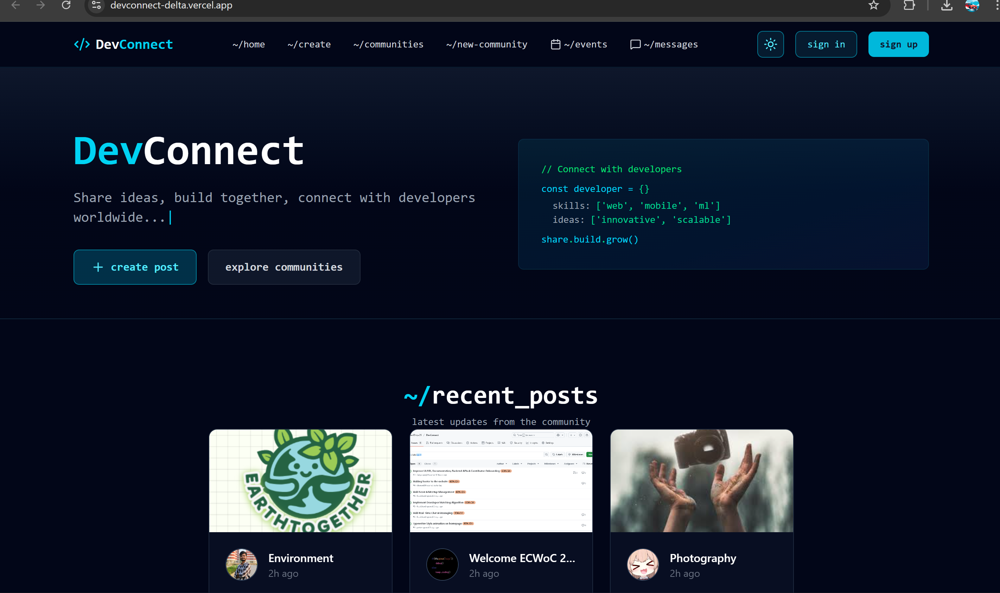
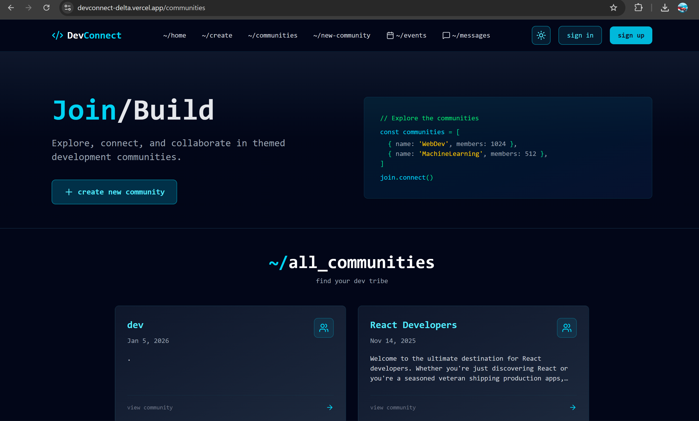

# DevConnect








A modern social platform for developers to share ideas, build communities, and connect with like-minded developers worldwide.

## 📋 Table of Contents

- [Overview](#overview)
- [Tech Stack](#tech-stack)
- [Features](#features)
- [Project Structure](#project-structure)
- [Getting Started](#getting-started)
- [Installation](#installation)
- [Environment Setup](#environment-setup)
- [Running the Project](#running-the-project)
- [Contributing](#contributing)
- [Code Style](#code-style)
- [Git Workflow](#git-workflow)
- [Key Components](#key-components)
- [Database Schema](#database-schema)
- [Common Tasks](#common-tasks)
- [Troubleshooting](#troubleshooting)

## 🎯 Overview

DevConnect is a full-stack web application that enables developers to:
- Create and share posts with the community
- Form and manage communities around shared interests
- Engage through nested comments and replies
- Like and interact with posts
- Discover other developers and their work

## 🛠 Tech Stack

### Frontend
- **React 18** - UI library
- **TypeScript** - Type safety
- **Tailwind CSS** - Styling
- **React Router** - Navigation
- **TanStack Query** - Data fetching & caching
- **Supabase Client** - Real-time database client
- **Lucide React** - Icon library

### Backend
- **Supabase** - PostgreSQL database & authentication
- **GitHub OAuth** - Social authentication

### Tools & Libraries
- **Vite** - Build tool
- **ESLint** - Code linting
- **Prettier** - Code formatting

## ✨ Features

- 🔐 **GitHub Authentication** - Sign in with GitHub account ,Gmail based authentication
- 📝 **Create Posts** - Share posts with images and content
- 👤 **Profile Dashboard** - View user details, email, account info, and manage sessions
- 💬 **Nested Comments** - Multi-level comment threads with collapse/expand
- 👥 **Communities** - Create and manage developer communities
- ❤️ **Likes System** - Vote on posts and comments
- 💬 **Real-Time Messaging** - Direct messages and group chats with live updates
- 📁 **File Sharing** - Share images and files in conversations
- 🔔 **Live Notifications** - Real-time typing indicators and message notifications
- 👤 **User Presence** - See who's online and their status
- 🎨 **Modern UI** - Dark theme with cyan accents, professional design
- 📱 **Responsive Design** - Works on desktop and mobile

## 📁 Project Structure

```
src/
├── components/
│   ├── Navbar.tsx                 # Navigation bar
│   ├── PostItem.tsx               # Individual post card
│   ├── PostList.tsx               # List of all posts
│   ├── PostDetail.tsx             # Full post view
│   ├── CommentItem.tsx            # Individual comment
│   ├── CommentSection.tsx         # Comments container
│   ├── LikeButton.tsx             # Like/vote button
│   ├── CommunityList.tsx          # List of communities
│   ├── CommunityDisplay.tsx       # Posts in a community
│   ├── CreatePost.tsx             # Post creation form
│   ├── CreateCommunity.tsx        # Community creation form
│   ├── MessagingInterface.tsx     # Main messaging layout
│   ├── ConversationList.tsx       # Conversation sidebar
│   ├── MessageList.tsx            # Message display area
│   ├── MessageInput.tsx           # Message composition
│   ├── ConversationHeader.tsx     # Chat header with actions
│   ├── CreateConversationModal.tsx # New chat creation
│   └── MessageNotificationBadge.tsx # Unread message indicator
├── pages/
│   ├── Home.tsx                   # Home page
│   ├── PostPage.tsx               # Post detail page
│   ├── CommunitiesPage.tsx        # Communities listing page
│   ├── CommunityPage.tsx          # Single community page
│   ├── CreatePostPage.tsx         # Post creation page
│   ├── CreateCommunityPage.tsx    # Community creation page
│   └── MessagesPage.tsx           # Messaging interface page
├── context/
│   ├── AuthContext.tsx            # Authentication context
|   └── ThemeContext.tsx           # Dark/light theme context 
├── hooks/
│   └── useMessaging.ts            # Messaging-related hooks
├── types/
│   └── messaging.ts               # TypeScript interfaces for messaging
├── supabase-client.ts             # Supabase configuration
├── theme.css                      # Theme-related global styles
├── App.tsx                        # Main app component
└── index.css                      # Global styles

```

## 🚀 Getting Started

### Prerequisites

- Node.js 16+ and npm/yarn
- Git
- A Supabase account
- A GitHub OAuth application

### Installation

1. **Clone the repository**

```bash
git clone https://github.com/yourusername/devconnect.git
cd devconnect
```

2. **Install dependencies**

```bash
npm install
```

3. **Create a `.env` file** in the root directory:

```env
VITE_SUPABASE_URL=your_supabase_url
VITE_SUPABASE_ANON_KEY=your_supabase_anon_key
```

4. **Set up GitHub OAuth**
   - Go to GitHub Settings → Developer settings → OAuth Apps
   - Create a new OAuth App
   - Set Authorization callback URL to http://localhost:5173/auth/callback
   - Add credentials to Supabase Authentication

### Environment Setup

#### Supabase Setup

1. Create a new Supabase project
2. Create tables with the following schema:

**Posts Table**

```sql
CREATE TABLE Posts (
  id BIGINT PRIMARY KEY GENERATED ALWAYS AS IDENTITY,
  title TEXT NOT NULL,
  content TEXT NOT NULL,
  image_url TEXT,
  avatar_url TEXT,
  community_id BIGINT REFERENCES Communities(id),
  user_id UUID NOT NULL,
  created_at TIMESTAMP DEFAULT NOW(),
  updated_at TIMESTAMP DEFAULT NOW()
);
```

**Comments Table**

```sql
CREATE TABLE Comments (
  id BIGINT PRIMARY KEY GENERATED ALWAYS AS IDENTITY,
  post_id BIGINT NOT NULL REFERENCES Posts(id),
  content TEXT NOT NULL,
  author TEXT NOT NULL,
  avatar_url TEXT,
  user_id UUID NOT NULL,
  parent_comment_id BIGINT REFERENCES Comments(id),
  created_at TIMESTAMP DEFAULT NOW()
);
```

**Communities Table**

```sql
CREATE TABLE Communities (
  id BIGINT PRIMARY KEY GENERATED ALWAYS AS IDENTITY,
  name TEXT NOT NULL,
  description TEXT,
  created_at TIMESTAMP DEFAULT NOW()
);
```

**Votes Table**

```sql
CREATE TABLE Votes (
  id BIGINT PRIMARY KEY GENERATED ALWAYS AS IDENTITY,
  post_id BIGINT NOT NULL REFERENCES Posts(id),
  user_id UUID NOT NULL,
  vote INT DEFAULT 1,
  created_at TIMESTAMP DEFAULT NOW(),
  UNIQUE(post_id, user_id)
);
```

**Messaging Tables**

For the complete messaging schema including conversations, messages, reactions, and real-time features, see `database-schema-messaging.sql`.

**Storage Setup**
- Create a bucket named `post-images` in Supabase Storage
- Create a bucket named `message-files` in Supabase Storage (private)
- Set `post-images` bucket to public
- Set `message-files` bucket to private

### Running the Project

```bash
# Development
npm run dev

# Build
npm run build

# Preview build
npm run preview

# Lint
npm run lint
```

The app will be available at http://localhost:5173

## 💬 Setting Up Messaging

For detailed instructions on setting up the real-time messaging system, see [MESSAGING_SETUP.md](MESSAGING_SETUP.md).

Quick setup:
1. Run the SQL schema from `database-schema-messaging.sql`
2. Create the `message-files` storage bucket (private)
3. Enable real-time for messaging tables
4. Navigate to `/messages` to start chatting!

## 🤝 Contributing

We welcome contributions! Here's how to get started:

1. **Fork the repository**
2. **Create a feature branch**

```bash
git checkout -b feature/your-feature-name
```

3. **Make your changes**
4. **Test your changes**
5. **Commit with clear messages**

```bash
git commit -m "feat: add new feature description"
```

6. **Push to your fork**

```bash
git push origin feature/your-feature-name
```

7. **Open a Pull Request**

### Areas for Contribution

- ✅ Bug fixes
- ✅ Feature enhancements
- ✅ UI/UX improvements
- ✅ Performance optimizations
- ✅ Documentation improvements
- ✅ Accessibility improvements

## 📝 Code Style

### TypeScript Guidelines
- Use explicit type annotations
- Avoid `any` type
- Create interfaces for data structures
- Use strict mode

### React Guidelines
- Use functional components with hooks
- Keep components focused and reusable
- Use proper TypeScript types for props
- Avoid inline styles (use Tailwind)

### Naming Conventions
- Components: PascalCase (e.g., PostItem.tsx)
- Functions: camelCase (e.g., fetchPosts)
- Constants: UPPER_SNAKE_CASE (e.g., MAX_ITEMS)
- Files: Match component/function name or use kebab-case

### Formatting

```bash
# Format code
npm run format

# Lint and fix
npm run lint -- --fix
```

## 🔄 Git Workflow

### Commit Message Format

```
<type>: <subject>

<body>

<footer>
```

**Types:**
- `feat`: A new feature
- `fix`: A bug fix
- `docs`: Documentation changes
- `style`: Code style changes (formatting)
- `refactor`: Code refactoring
- `perf`: Performance improvements
- `test`: Adding tests
- `chore`: Build, dependency updates

**Example:**

```
feat: add nested comments support

Implemented multi-level comment threads with collapse/expand functionality.
Added CommentItem component to handle recursive rendering.

Closes #123
```

## 🔧 Key Components

### Authentication (AuthContext.tsx)
Manages user authentication state including email/password login, GitHub OAuth, logout, password reset, and profile session handling.

```typescript
const { signInWithGithub, signOut, user, isLoading } = useAuth();
```

### Posts (PostItem.tsx, PostList.tsx)
Displays individual posts and collections of posts with lazy loading.

### Comments (CommentItem.tsx, CommentSection.tsx)
Handles nested comment threads with real-time updates using TanStack Query.

### Like System (LikeButton.tsx)
Manages post votes with optimistic updates and cache invalidation.

### Communities (CommunityList.tsx, CommunityDisplay.tsx)
Shows community listings and posts within communities.

### User Account Pages
- `/signin` – Email & GitHub login
- `/signup` – Create account
- `/reset-password` – Password recovery
- `/profile` – User profile dashboard


## 📊 Database Schema

### Key Relationships

- **Users** → **Posts** (1:N)
- **Posts** → **Comments** (1:N)
- **Comments** → **Comments** (1:N, self-referencing for nested replies)
- **Posts** → **Communities** (N:1)
- **Posts** → **Votes** (1:N)

### Query Patterns

Get posts with community info:
```sql
SELECT *, Communities(name) FROM Posts
```

Get comments with nested structure:
```sql
SELECT * FROM Comments WHERE post_id = ? ORDER BY created_at
```

Get likes for a post:
```sql
SELECT COUNT(*) FROM Votes WHERE post_id = ? AND vote = 1
```

## 🛠 Common Tasks

### Adding a New Feature

1. **Create components** in `src/components/`
2. **Create page** (if needed) in `src/pages/`
3. **Update routing** in `App.tsx`
4. **Add data fetching** using TanStack Query
5. **Style with Tailwind CSS**
6. **Test thoroughly**
7. **Update documentation**

### Making an API Call

```typescript
import { useQuery } from '@tanstack/react-query';
import { supabase } from '../supabase-client';

const { data, isLoading, error } = useQuery({
  queryKey: ['posts'],
  queryFn: async () => {
    const { data, error } = await supabase
      .from('Posts')
      .select('*')
      .order('created_at', { ascending: false });
    
    if (error) throw new Error(error.message);
    return data;
  }
});
```

### Adding Styling

Use Tailwind CSS classes:

```tsx
<div className="bg-slate-900/50 border border-slate-800 rounded-lg p-4">
  <h2 className="text-xl font-semibold text-white">Title</h2>
</div>
```

## 🐛 Troubleshooting

### Issue: "Could not find the table in schema cache"
**Solution:** Table names are case-sensitive. Ensure you're using the correct casing (e.g., Comments, not comments).

### Issue: Images not uploading
**Solution:** Check that the `post-images` bucket exists in Supabase Storage and is set to public.

### Issue: Authentication not working
**Solution:** Verify GitHub OAuth credentials are correctly set in Supabase and the callback URL matches your app URL.

### Issue: Comments not loading
**Solution:** Check database permissions in Supabase. Ensure RLS policies allow reading comments.

### Issue: Build errors
**Solution:**

```bash
# Clear node modules and reinstall
rm -rf node_modules package-lock.json
npm install
npm run build
```

## 📚 Additional Resources

- [Supabase Docs](https://supabase.com/docs)
- [React Documentation](https://react.dev)
- [TypeScript Handbook](https://www.typescriptlang.org/docs/)
- [Tailwind CSS](https://tailwindcss.com/docs)
- [TanStack Query](https://tanstack.com/query/latest)

## 📄 License

This project is licensed under the MIT License - see the LICENSE file for details.

## 💬 Support

Have questions? 
- Open an issue on GitHub
- Check existing issues for solutions
- Join our discussions

## 🌟 Acknowledgments

Thanks to all contributors who have helped improve DevConnect!

---

**Happy coding!** 🚀
